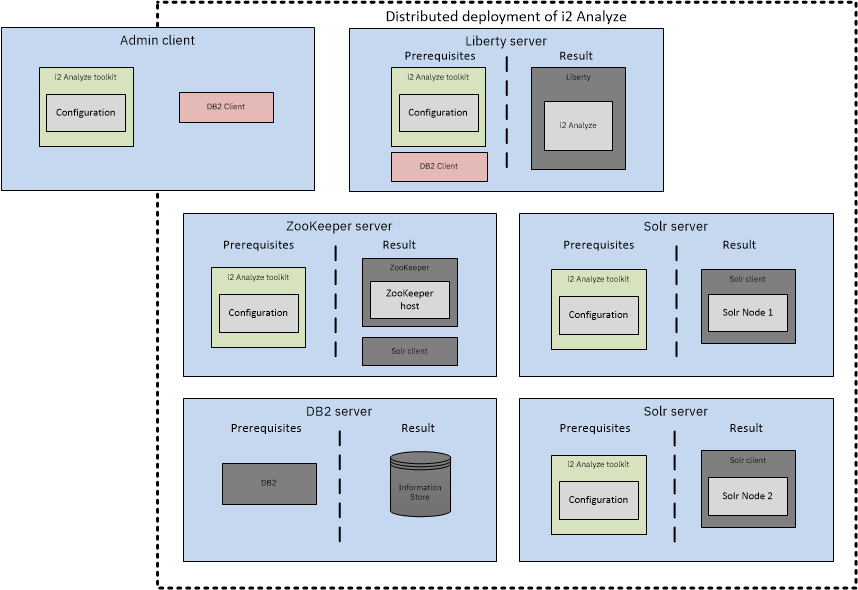

# Understanding the distributed deployment example
The distributed deployment example demonstrates how to build a distributed deployment of i2 Analyze on multiple servers. To avoid the need for multiple physical servers, Docker is used to simulate the servers.

The distributed deployment example not only provides the environment for the deployment, but configures and deploys i2 Analyze across the servers in the same way that a system implementer does.

In the distributed deployment example, i2 Analyze with the Opal services is deployed on seven servers:
- One for Liberty and the i2 Analyze application
- One for the database management system for the Information Store database
- Two for each Solr node
- Three for ZooKeeper that manages the Solr configuration

The following diagram shows the servers that i2 Analyze is deployed on, and what is required on each server:

In addition to the containers that replicate physical servers in a deployment of i2 Analyze, as part of the distributed deployment example, extra containers are used to configure the Docker environment. These extra containers do not represent physical servers in a non-Docker environment. The additional containers are:
- Ubuntu toolkit  
  In the example Docker environment, i2 Analyze is installed on the Ubuntu operating system. Each container with i2 Analyze installed is based on this container.
  >Note: Installation of i2 Analyze on Ubuntu is not supported in any environment other than the distributed deployment example.

- Db2 installer  
  This container contains the prerequisites for Db2 to be installed in the Docker environment. It is used by the Db2 container to install Db2.

- Base client  
  This container is used to install the Db2 Client. It is used by the Liberty and Admin client containers to install the Db2 Client when you are using Db2 as the database management system.

- Admin client  
  There are two versions of the admin client container in the example, one for SQL Server and one for Db2.
  This container contains an installation of i2 Analyze and the client required to connect to the remote database. In the distributed deployment example, this container is used to run commands that impact other containers. In a non-Docker environment, you can run these commands on the specific physical server.

Read the following documentation and `Dockerfiles` to gain an understanding of how to deploy a similar i2 Analyze system in a non-Docker environment, on physical servers. All of the steps that you must complete to deploy a distributed i2 Analyze system are demonstrated in the distributed deployment example.

After you deploy the distributed deployment example, information is provided for how to complete configuration tasks in a distributed deployment of i2 Analyze.

---

## Host names in a distributed environment
When i2 Analyze is deployed in a distributed environment, the `topology.xml` file contains multiple host names. In the distributed deployment example, the host names that are used include; `sqlserver`, `db2`, `solr`, `solr2`, `zookeeper`, `zookeeper2`, `zookeeper3`, and `liberty`.

To deploy and configure i2 Analyze is a distributed environment, you can use the `--hostname` argument restrict the effect of the toolkit task to the host name that you provide. For example, `setup -t startSolrNodes --hostname solr` starts the Solr nodes on the server with the host name `solr`. If you run `setup -t startSolr --hostname solr2`, only the Solr nodes on the server with host name `solr2` start.

If a toolkit task that you run with a specific host name impacts multiple servers, you must run that toolkit task for each server with their host name specified.

---

## Configurations
The distributed deployment example includes a number of configurations that can be used to demonstrate a deployment of i2 Analyze.

The configuration in the `src/configuration` directory is the default configuration for the distributed deployment example. i2 Analyze is deployed in the topology that is described above, with the Information Store on SQL Server.

The `src/configuration_mods` directory contains the configuration modifications, separated into database management system, that are required to configure i2 Analyze for specific deployment patterns or features. You can compare the changes in these directories to the `src/configuration` directory to identify what is required for these deployments.
- **SSL deployments**  
The configurations that include `ssl` secure connection to and between components of i2 Analyze. For more information, see [Deploying the distributed deployment example with security](securing_ssl.md).
- **i2 Connect**  
The `i2connect` configuration deploys i2 Analyze with i2 Connect and an example connector. For more information about configuring client certificate authentication, see [Deploying the distributed deployment example with i2 Connect](deploy_i2_connect.md).
- **IBM HTTP Server**  
The `ihs` and `ihs_ssl` configurations deploy the distributed deployment example with an IBM HTTP Server that clients use to connect to the deployment. For more information, see [Deploying the distributed deployment example with IBM HTTP Server](deploy_walk_through_http.md).
